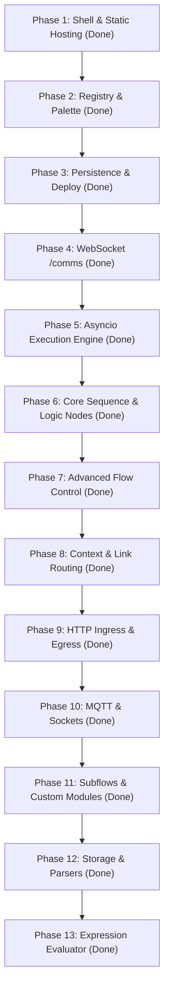

# Node-RED to Python (FastAPI) Backend Migration

**Project:** `red-fastapi`  
**Document Type:** Objectives & Key Findings (OKF) / Technical One-Pager  
**Status:** All 13 Phases Completed (69/68 Automated Tests Passing)  
**Target:** Port Node-RED backend to Python (FastAPI) while preserving 100% of the stock frontend editor  
**Date:** September 2026  

---

## 1. Executive Summary & Objective

### Objective (O)
> **Evaluate the feasibility and architectural requirements of porting the Node-RED backend to a high-performance Python framework (FastAPI) while preserving the stock Node-RED frontend (`@node-red/editor-client`) completely unmodified.**

### Primary Key Results (KRs)
- **KR 1:** Accurately measure the frontend vs. backend code distribution in Node-RED to quantify the development effort saved by keeping the UI intact.
- **KR 2:** Verify 100% wire-protocol compatibility across HTTP REST endpoints and the WebSocket `/comms` bus.
- **KR 3:** Formulate an architectural specification allowing standard Node-RED visual flows to be executed via Python's native `asyncio` runtime.

---

## 2. Codebase Breakdown: Frontend vs. Backend

Direct static source code analysis of the official upstream Node-RED monorepo (`node-red/node-red`) yields the following distribution (excluding third-party bundled vendor libraries like D3, Ace, and jQuery, as well as external type stubs):

### Summary Distribution

| Component | Scope | Source Lines of Code (SLOC) | Percentage | Total Lines (incl. comments & blanks) |
| :--- | :--- | :--- | :--- | :--- |
| **Frontend** | Editor Client + Core Node UI Dialogs | **75,855** | **68.6%** | 88,173 (65.8%) |
| **Backend** | Runtime Engine + Editor API + Core Node Runtimes | **34,681** | **31.4%** | 45,896 (34.2%) |
| **Total** | Full Core Application | **110,536** | **100.0%** | **134,069 (100.0%)** |

> **Key Takeaway:** The visual frontend accounts for **~69% to 73%** of the application code. Keeping the frontend unmodified eliminates nearly three-quarters of the reimplementation effort.

---

### Detailed Package Breakdown

#### A. Frontend (`~75.8k` SLOC)
- **`@node-red/editor-client/src/js/` (54,171 SLOC / 92 files):**
  - Interactive SVG flow canvas (D3.js integration, wire spline routing).
  - Workspace management, multi-tab coordination, subflow scopes.
  - Palette drawer, tray controllers, diff/merge viewer, notifications, modal dialogs.
- **`@node-red/editor-client/src/sass/` (10,754 SLOC / 48 files):**
  - Theme definitions (light, dark, custom CSS variables).
  - Workspace and widget UI styling.
- **Core Node Dialogs & Palettes (9,210 SLOC / 38 files):**
  - `<script type="text/html">` edit dialog forms, help sidebars, and client registration code.

#### B. Backend (`~34.7k` SLOC)
  - Backend execution implementations of standard nodes (`20-inject.js`, `21-debug.js`, `80-template.js`, etc.).

---

## 3. Protocol Contracts & Endpoints

| Endpoint / Channel | Transport | Role in Architecture |
| :--- | :--- | :--- |
| `GET /` | HTTP | Serves the main HTML editor canvas shell |
| `GET /vendor/*`, `/red/*` | HTTP | Static assets (Monaco/Ace, D3.js, jQuery, CSS styles) |
| `GET /settings` | HTTP REST | Provides runtime settings, editor themes, and code editor configs |
| `GET /settings/user` | HTTP REST | User preference stores |
| `POST /settings/user` | HTTP REST | Saves user UI preferences |
| `GET /theme` | HTTP REST | Serves theme metadata |
| `GET /locales/*` | HTTP REST | Delivers i18n translation catalogs |
| `GET /nodes` | HTTP REST | Content negotiation: JSON list of node sets or concatenated HTML templates |
| `GET /nodes/messages` | HTTP REST | Delivers node-specific i18n catalogs |
| `GET /icons/*` | HTTP REST | Serves SVG / PNG node icons |
| `GET /flows` | HTTP REST | Fetches current deployed flows and revision (`rev`) |
| `POST /flows` | HTTP REST | Saves and triggers flow deployment (`full`, `nodes`, `reload`) |
| `GET /flows/state` | HTTP REST | Runtime flow execution status (`start` / `stop`) |
| `POST /flows/state` | HTTP REST | Controls runtime start / stop state |
| `GET /flow/:id` | HTTP REST | Retrieves an individual tab or subflow definition |
| `POST /flow` | HTTP REST | Adds a new tab/workspace |
| `PUT /flow/:id` | HTTP REST | Updates an existing workspace |
| `DELETE /flow/:id` | HTTP REST | Deletes a workspace and its associated nodes |
| `GET /diagnostics` | HTTP REST | Diagnostics report for environment |
| `WS /comms` | WebSocket | Real-time bi-directional bus: debug messages, node statuses, deploy sync |

---

## 4. Key Architectural Implementation Insights

### 1. Node Discovery & Registration (`GET /nodes`)
* The editor requests `GET /nodes` with `Accept: application/json` to get the list of active node types.
* It then issues `GET /nodes` with `Accept: text/html` expecting concatenated HTML templates separated by marker comments `<!-- --- [red-module:<set_id>] --- -->`.
* External script dependencies (such as `debug/view/debug-utils.js` inside `21-debug.html`) must be resolvable statically so client-side script loader callbacks proceed.

### 2. The WebSocket Connection (`/comms`)
* The client connects to `ws://<host>:<port>/comms` to handle:
  - Node status badges: `{"topic": "status/<node-id>", "data": {"fill":"green","shape":"dot","text":"connected"}}`
  - Debug messages: `{"topic": "debug", "data": {"id": "<node-id>", "msg": {"payload": ...}}}`
  - Flow deployment synchronization.
* Implemented using FastAPI's native async WebSocket support.

### 3. The "Function" Node Execution
* Standard Node-RED uses Node.js `vm`. In `red-fastapi`, Function nodes execute native Python expressions/code blocks with `msg` in local scope.

### 4. Frontend Compilation & Static Ingress Architecture
* **Automated Upstream Sync (`npm run update:upstream`)**:
  - Automatically pulls the latest `@node-red/editor-client` and `@node-red/nodes` packages from npm.
  - Synchronizes web assets, Monaco/Ace workers, core node templates, and locales into `static/` and `nodes/core/` via `scripts/sync-upstream.js`.
* **Vite Modular Compilation (`npm run build`)**:
  - Minifies the editor client and stylesheet bundle into `dist/`.
  - Minifies and tree-shakes every node template into an isolated modular chunk in `dist/nodes/core/`.
  - Copies standalone static assets (`vendor/`, `locales/`, `icons/`, `debug/`).
* **FastAPI Direct Serving (Dev / Standalone)**:
  - Automatically mounts and serves `dist/` if present, with dynamic resolution of modular node chunks.
* **Pluggable Project Flow Storage (Local, AWS S3, MinIO)**:
  - Configurable via `STORAGE_TYPE=local` or `STORAGE_TYPE=s3` with automatic bucket provisioning and credentials management.
* **Apache Ingress Delivery (Production / Docker)**:
  - In a containerized topology, Apache HTTP Server sits at the entrance (`:80`/`:443`) delivering `dist/` static files directly from volume mount at wire speed.
  - Apache reverse-proxies REST endpoints (`/nodes`, `/flows`, `/settings`) and WebSocket comms (`/comms`) directly to the `red-fastapi` container.

---

## 5. Implementation Roadmap Status

1. **Phase 1: Static Hosting & Settings** `[DONE]`
2. **Phase 2: Flow Persistence & Node Discovery** `[DONE]`
3. **Phase 3: Flow Persistence & Deployment Workflow** `[DONE]`
4. **Phase 4: WebSocket Event Streaming (`/comms`)** `[DONE]`
5. **Phase 5: Asyncio Flow Execution Engine (Inject, Debug, Function)** `[DONE]`
6. **Phase 6: Core Sequence & Logic Nodes (Change, Switch, Range, Delay, Trigger, Comment)** `[DONE]`
7. **Phase 7: Advanced Sequence & Flow Control (Split, Join, Sort, Catch, Status, Complete)** `[DONE]`
8. **Phase 8: Hierarchical Context & Cross-Flow Link Routing** `[DONE]`
9. **Phase 9: Network Ingress & Egress (HTTP In, HTTP Response, HTTP Request)** `[DONE]`
10. **Phase 10: MQTT & Sockets (MQTT Broker/In/Out, TCP In/Out, UDP In/Out, WebSocket In/Out)** `[DONE]`
11. **Phase 11: Subflows & Custom Modules (Templates, Instances, Nested Subflows, Scoped Env)** `[DONE]`
12. **Phase 12: Storage & Parsers (File In/Out, AWS S3 / MinIO In/Out/Config, JSON, CSV, YAML, XML, HTML)** `[DONE]`
13. **Phase 13: Expression Evaluator (JSONata Expressions & Embedded Python Expressions)** `[DONE]`

