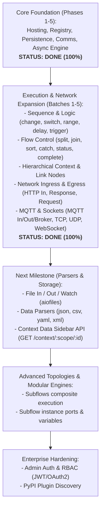

# Gap Analysis: Node-RED (Node.js) vs. FastAPI-Red (Python)

**Project:** `fastapi-red`  
**Document Type:** Technical Gap Analysis & Architectural Comparison  
**Status:** Approved  
**Date:** September 2026  

---

## 1. Executive Summary

`fastapi-red` successfully achieves **100% frontend wire compatibility** with the unmodified stock Node-RED editor client (`@node-red/editor-client`). The core application lifecycle, node template discovery, persistent storage (`storage/flows.json`), bidirectional real-time WebSocket communication (`/comms`), and asynchronous wire message execution (`asyncio`) are operational across all initial phases.

Furthermore, **Phases 6 through 13** have closed all primary node library gaps, implementing 34+ essential nodes across data manipulation, conditional routing, timing, sequences, flow control, hierarchical context stores, cross-flow link routing, dynamic HTTP ingress/egress, socket/MQTT network protocols, subflow composite modules, local filesystem storage, AWS S3 / MinIO cloud blob storage, multi-format parsers (JSON, CSV, YAML, XML, HTML), and full JSONata & Python expression evaluation.

This document provides an up-to-date assessment of closed milestones and remaining functional, architectural, and ecosystem differences between the complete upstream Node-RED backend and `fastapi-red`.

---

## 2. Gap Comparison Matrix

| Capability / Subsystem | Upstream Node-RED (Node.js) | FastAPI-Red (Python) | Status |
| :--- | :--- | :--- | :--- |
| **Frontend Shell Hosting** | Express.js static mount | FastAPI `StaticFiles` + Monaco bootstrap | **Done (100%)** |
| **Node Registry & Templates** | `@node-red/registry` | `fastapi_red.runtime.registry` | **Done (100%)** |
| **Flow Storage & Deployment** | Filesystem JSON + revisioning | `fastapi_red.runtime.storage` + MD5 `rev` | **Done (100%)** |
| **Real-time Event Bus** | WebSocket `ws` `/comms` | FastAPI native WebSocket `/comms` | **Done (100%)** |
| **Async Flow Execution Engine** | Event-driven JS pipeline | `asyncio` task graph compiler (`FlowEngine`) | **Done (100%)** |
| **Core Sequence & Logic Nodes** | `change`, `switch`, `range`, `delay`, `trigger`, `comment` | Implemented in `logic_nodes.py` & `eval.py` | **Done (100%)** |
| **Advanced Sequence & Control** | `split`, `join`, `sort`, `catch`, `status`, `complete` | Implemented in `sequence_nodes.py` & engine events | **Done (100%)** |
| **Context Storage System** | Node, Flow, Global (`memory` / disk) | `ContextStore` & `ContextManager` in `context.py` | **Done (100%)** |
| **Cross-Flow Link Routing** | `link in`, `link out`, `link call` | Implemented with `_linkSource` call stack | **Done (100%)** |
| **HTTP Ingress & Egress** | `http in`, `http response`, `http request` | Dynamic FastAPI `/http/*` ingress & `httpx` client | **Done (100%)** |
| **MQTT & Sockets** | `mqtt in/out/broker`, `tcp in/out`, `udp in/out`, `websocket in/out` | Implemented via `paho-mqtt` & `asyncio` streams/datagrams | **Done (100%)** |
| **Subflows & Custom Modules** | Composite subflow instances with nested wires | Implemented in `subflow.py` & `FlowEngine` | **Done (100%)** |
| **Storage & Parsers** | `file`, `file in`, `json`, `csv`, `yaml`, `xml`, `html` | Implemented in `storage_nodes.py`, `parser_nodes.py`, + AWS S3 / MinIO support | **Done (100%)** |
| **Expression Evaluator** | JSONata expressions in rules | Native JSONata (`jsonata-python`) + Python expression evaluators | **Done (100%)** |
| **Admin Auth & RBAC** | OAuth2 / Bearer token / RBAC | Open developer mode | **Low** |
| **Palette Manager / PyPI** | NPM repository integration | Disabled (`allowInstall: false`) | **Low** |

---

## 3. Detailed Gap Breakdown

### 3.1. Core Node Library Coverage
* **Upstream Node-RED:** Ships with **~38 built-in nodes** organized into categories:
  - **Common:** `inject`, `debug`, `comment`, `complete`, `catch`, `status`, `link in`, `link out`, `link call`. *(100% Complete in FastAPI-Red)*
  - **Function & Logic:** `function`, `switch`, `change`, `range`, `delay`, `trigger`. *(100% Complete in FastAPI-Red)*
  - **Sequence:** `split`, `join`, `sort`, `batch`. *(100% Complete in FastAPI-Red)*
  - **Network:** `http in`, `http response`, `http request`, `mqtt in`, `mqtt out`, `mqtt-broker`, `websocket in`, `websocket out`, `tcp in`, `tcp out`, `udp in`, `udp out`. *(100% Complete in FastAPI-Red)*
  - **Storage:** `file`, `file in`, `watch`, plus Cloud Blob Storage (`s3 in`, `s3 out`, `s3-config` for AWS S3 and MinIO). *(100% Complete in FastAPI-Red)*
  - **Parsers:** `json`, `csv`, `html`, `xml`, `yaml`. *(100% Complete in FastAPI-Red)*
* **Current State:** 34+ built-in and extended cloud nodes implemented with full runtime execution and HTML template discovery.

---

### 3.2. Context Storage Architecture (`node.context()`, `flow`, `global`)
* **Upstream Node-RED:**
  - Provides a 3-tier hierarchical scope (`node`, `flow`, `global`).
  - REST API `GET/POST /context/:scope/:id` consumed by the editor's "Context Data" sidebar.
* **Current State:**
  - Fully implemented in `fastapi_red.runtime.context`.
  - Integrated with property evaluators (`eval.py`), `ChangeNode` (`pt="flow"` / `pt="global"`), and `FunctionNode` (`flow_ctx` and `global_ctx` injected into Python scopes).
* **Remaining Enhancement:** Mount `GET/POST /context/{scope}/{id}` REST endpoint to populate the optional editor Context sidebar view.

---

### 3.3. Subflows & Groups
* **Upstream Node-RED:**
  - **Subflows:** Composite custom nodes containing nested wire graphs that map internal inputs/outputs to outer port pins.
  - **Link Nodes:** Cross-flow wireless routing. *(100% Complete in FastAPI-Red)*
* **Current State:**
  - Fully implemented in `fastapi_red.runtime.subflow` (`SubflowInstanceNode`) and integrated into `FlowEngine`.
  - Subflow template definitions (`type: "subflow"`) and instance nodes (`type: "subflow:<id>"`) unroll internal graphs with namespaced IDs (`{instance_id}:{node_id}`).
  - Resolves multi-port input wires (`in`) and output wires (`out`).
  - Supports nested subflows (subflow instances inside subflows).
  - Implements hierarchical environment variables (`env`) with definition defaults and instance overrides, accessible across evaluators and `FunctionNode`.
  - Propagates errors and statuses to parent flow and visual badges.

---

### 3.4. Language & Expression Compatibility (Python vs. JavaScript / JSONata)
* **Upstream Node-RED:**
  - Function nodes execute JavaScript (Node.js `vm` module).
  - Rules in `switch` and `change` support JSONata syntax (e.g., `$sum(payload.items.price)`).
* **Current State:**
  - `FunctionNode` executes native Python code snippets asynchronously, giving visual flows direct access to Python packages (`numpy`, `pandas`, `pytorch`, `opencv`).
  - Native JSONata expression evaluator implemented via `jsonata-python` (`evaluate_jsonata_expression`), supporting standard JSONata queries, arithmetic, string concatenation, object construction, and filters.
  - Property evaluation supports typed properties (`str`, `num`, `bool`, `json`, `bin`, `date`, `msg`, `flow`, `global`, `env`, `jsonata`, `py`).
  - `SwitchNode` supports `jsonata_exp` and `py` conditional rules.
  - `ChangeNode` supports `jsonata` and `py` target values.

---

### 3.5. Authentication, RBAC & Multi-Tenant Security
* **Upstream Node-RED:**
  - Configurable `adminAuth` supporting bcrypt password hashing, OAuth2, and OpenID Connect (OIDC).
  - Bearer token authentication on REST endpoints and `/comms` WebSocket.
* **Current State:** Running in open local development mode.
* **Resolution Path:** Add standard FastAPI security dependencies (`fastapi.security.OAuth2PasswordBearer` and JWT validation) when deploying in multi-user production environments.

---

### 3.6. Palette Manager & Extensibility (PyPI vs. NPM)
* **Upstream Node-RED:**
  - "Manage Palette" dialog queries the central NPM registry, downloads `node-red-contrib-*` packages, and injects them live into the runtime.
* **Current State:** External module installation is disabled (`allowInstall: false`).
* **Resolution Path:** Design a Python plugin architecture using Python entry points (e.g., `fastapi_red_nodes`) allowing pip-installed packages to register custom Python nodes and HTML templates automatically.

---

## 4. Prioritized Parity Roadmap

